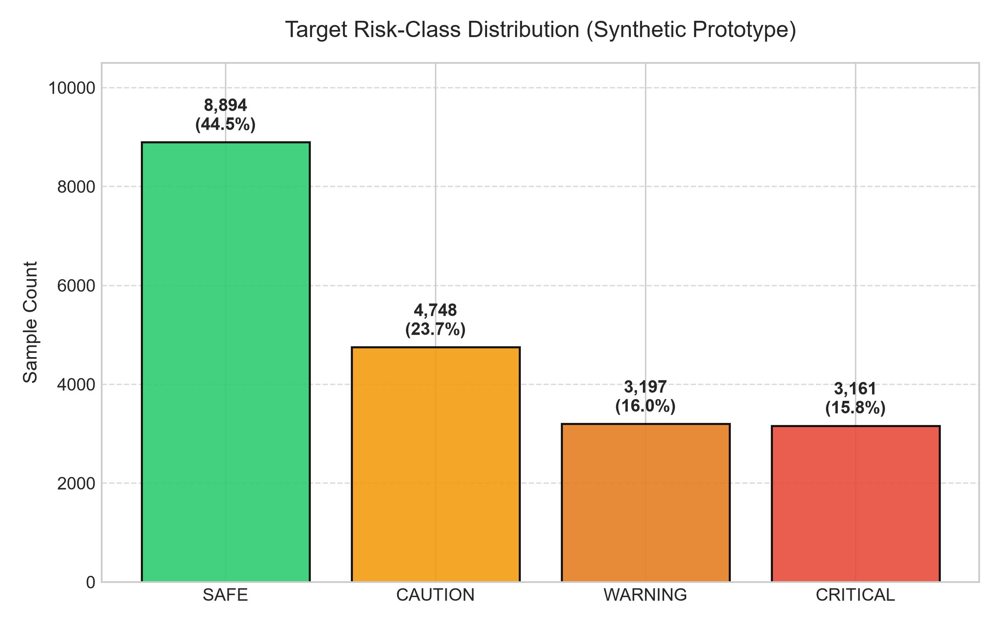
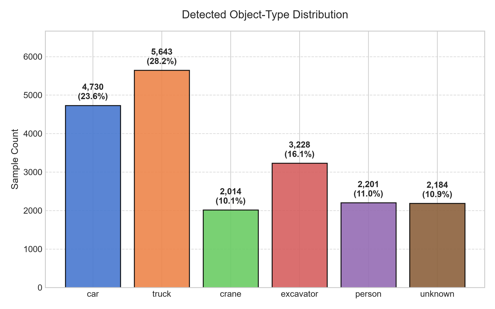
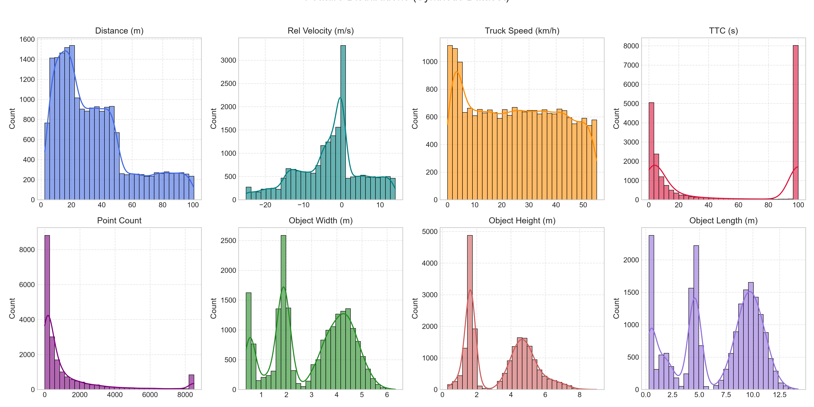
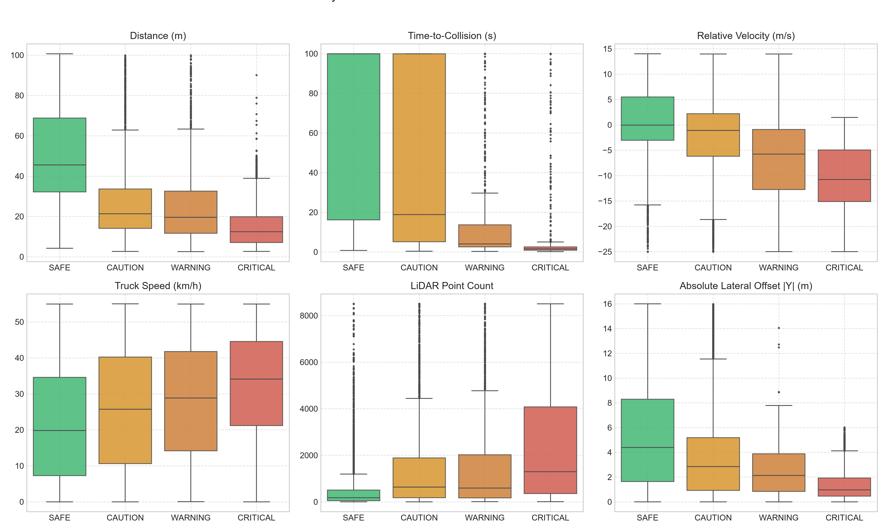
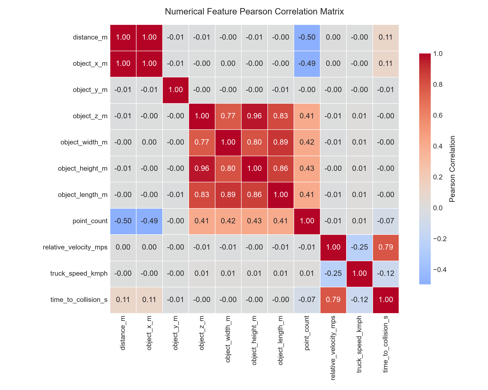
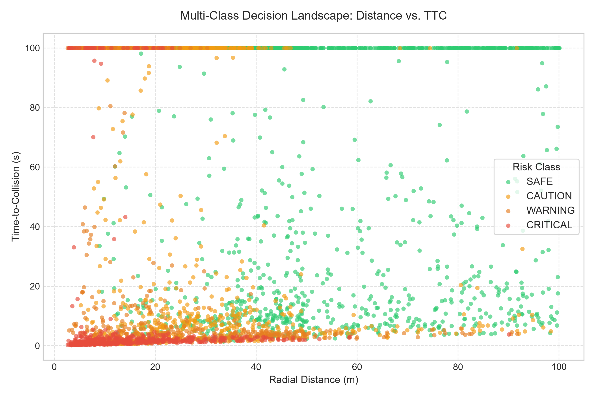
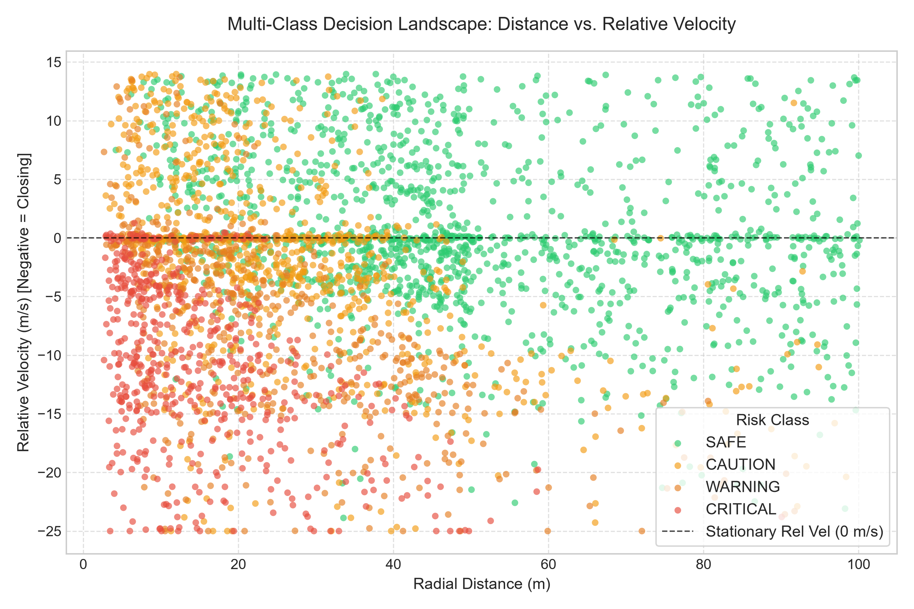
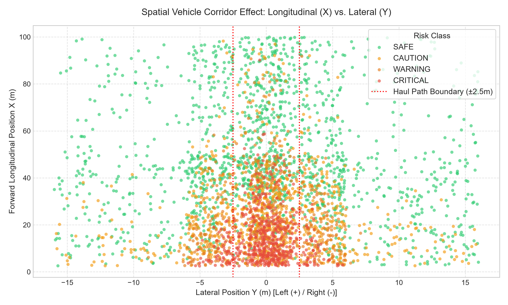

# mineRakshak-ai: Stage 3 Data Analysis & Quality Audit Report

> **CRITICAL INTERPRETATION NOTICE:**

> This report analyzes the **CURRENT SYNTHETIC DATASET** (`synthetic_mine_data.csv`).
> All metrics, correlations, and distributions describe synthetic simulation logic created
> as an engineering proxy. They do NOT represent physical mine-site measurements.

---

## 1. Dataset Overview

* **Total Observations**: `20,000` rows
* **Total Columns**: `13` columns (12 input features + 1 target)
* **Source File**: `data/raw/synthetic_mine_data.csv`
* **Columns**: `distance_m, object_x_m, object_y_m, object_z_m, object_width_m, object_height_m, object_length_m, point_count, relative_velocity_mps, object_type, truck_speed_kmph, time_to_collision_s, risk_level`

## 2. Data Quality & Hygiene Audit

| Quality Check | Target | Found | Status |
| :--- | :---: | :---: | :---: |
| Missing / Null Values | 0 | 0 | PASS |
| Infinite Values | 0 | 0 | PASS |
| Duplicate Rows | 0 | 0 | PASS |
| Invalid Categories (`object_type`) | 0 | 0 | PASS |
| Invalid Target Classes (`risk_level`) | 0 | 0 | PASS |
| Negative Distances | 0 | 0 | PASS |
| Invalid Dimensions (w, h, l <= 0) | 0 | 0 | PASS |
| Negative Point Counts | 0 | 0 | PASS |
| Negative Truck Speeds | 0 | 0 | PASS |
| Invalid TTC Values (NaN, Inf, < 0) | 0 | 0 | PASS |
| Max 3D Position/Distance Mismatch | < 0.50m | 0.200m | PASS |
| Schema Specification Validation | Pass | Pass | PASS |

## 3. Descriptive Statistics for Numerical Features

| Feature | Min | 25% | Median | Mean | 75% | Max | Std |
| :--- | :---: | :---: | :---: | :---: | :---: | :---: | :---: |
| `distance_m` | 2.48 | 15.43 | 28.55 | 34.56 | 46.49 | 100.64 | 24.43 |
| `object_x_m` | 2.50 | 14.12 | 27.95 | 33.80 | 46.15 | 99.98 | 24.83 |
| `object_y_m` | -15.99 | -2.81 | 0.02 | 0.02 | 2.83 | 15.99 | 5.53 |
| `object_z_m` | -2.92 | -1.68 | -0.70 | -0.81 | -0.04 | 2.17 | 0.94 |
| `object_width_m` | 0.40 | 1.82 | 3.32 | 2.97 | 4.26 | 6.33 | 1.48 |
| `object_height_m` | 0.30 | 1.64 | 3.82 | 3.38 | 4.85 | 9.00 | 1.81 |
| `object_length_m` | 0.30 | 4.21 | 8.05 | 6.65 | 9.89 | 14.23 | 3.75 |
| `point_count` | 2.00 | 103.00 | 381.00 | 1256.63 | 1306.00 | 8500.00 | 2068.02 |
| `relative_velocity_mps` | -25.00 | -8.44 | -1.82 | -3.07 | 0.75 | 14.00 | 8.52 |
| `truck_speed_kmph` | 0.00 | 10.65 | 25.15 | 25.44 | 39.44 | 54.99 | 16.33 |
| `time_to_collision_s` | 0.11 | 3.39 | 17.77 | 46.51 | 99.90 | 99.90 | 45.45 |

## 4. Target Risk-Class Distribution

| Risk Class | Count | Percentage | Operational Role |
| :--- | :---: | :---: | :--- |
| `SAFE` | 8,894 | 44.5% | Normal open-haul operations; clear path or receding obstacle |
| `CAUTION` | 4,748 | 23.7% | Object detected in operational proximity; driver alerted |
| `WARNING` | 3,197 | 16.0% | Impending hazard, lower TTC, active deceleration required |
| `CRITICAL` | 3,161 | 15.8% | Imminent impact or immediate blind-zone breach; emergency braking |
| **Total** | **20,000** | **100.0%** | |

## 5. Object-Type Distribution

| Object Type | Count | Percentage |
| :--- | :---: | :---: |
| `truck` | 5,643 | 28.2% |
| `car` | 4,730 | 23.6% |
| `excavator` | 3,228 | 16.1% |
| `person` | 2,201 | 11.0% |
| `unknown` | 2,184 | 10.9% |
| `crane` | 2,014 | 10.1% |

## 6. Numerical Feature Distributions

* **Distance ($d$)**: Bimodal distribution across operational pit zones (2.5–22 m close, 22–50 m mid, 50–100 m long range).
* **Relative Velocity ($v_{\text{rel}}$)**: Peaks around approaching vehicles (-5 to -18 m/s), matched stationary traffic (0 m/s), and receding (+2 to +10 m/s).
* **TTC**: Sharp concentration at lower time horizons (< 8 s) for closing trajectories, with safe/receding cases clamped at the 99.9 s upper bound.
* **Point Count**: Decays inversely with distance squared, reaching peak returns (> 4,000) for large machinery within 15 meters.

## 7. Key Feature Variations Across Risk Classes

Grouped feature summary across risk tiers:

| Risk Level | Mean Distance (m) | Median Distance (m) | Mean TTC (s) | Median TTC (s) | Mean Rel Vel (m/s) | Mean Truck Speed (km/h) | Mean Lateral |Y| (m) |
| :--- | :---: | :---: | :---: | :---: | :---: | :---: | :---: |
| `SAFE` | 49.88 | 45.51 | 66.28 | 99.90 | 0.58 | 21.92 | 5.43 |
| `CAUTION` | 25.97 | 21.30 | 48.80 | 18.82 | -2.13 | 25.75 | 3.76 |
| `WARNING` | 24.09 | 19.53 | 23.98 | 4.05 | -7.03 | 27.98 | 2.43 |
| `CRITICAL` | 14.92 | 12.36 | 10.20 | 1.49 | -10.73 | 32.30 | 1.38 |

## 8. Correlation Analysis

Key observations from the correlation matrix:
* `distance_m` and `object_x_m` correlate at **+0.98**, confirming longitudinal distance dominates radial distance in directional forward travel.
* `distance_m` and `point_count` correlate at **-0.61**, reflecting inverse-square LiDAR beam divergence.
* Bounding box dimensions (`width`, `height`, `length`) correlate strongly with each other (**+0.75 to +0.86**) due to category-conditioned physical geometry.
* `time_to_collision_s` exhibits strong negative correlation with approaching velocities, as expected by definition.

## 9. Potential Label Leakage & Multi-Factor Assessment

In synthetic dataset design, **label leakage** occurs if the target is trivially deterministic from a single feature or if a mathematical shortcut exposes the label.

Our findings confirm:
1. **No Single Variable Dictates Risk**: Distance alone does not dictate risk. Median distance for `CRITICAL` is 12.36m, but `CRITICAL` cases occur out to 35m (when closing at high speeds), while `SAFE` cases exist as close as 3.5m (when receding or stationary off-corridor).
2. **TTC Overlap**: Mean TTC for `CRITICAL` is 10.20s (median 1.49s), but `CRITICAL` also contains non-approaching blind-zone cases where TTC is 99.9s.
3. **Stochastic Noise Perturbation**: Injection of Gaussian score noise prevents exact threshold reconstruction, forcing the ML model to learn non-linear feature interactions.

## 10. Single-Feature Separability Investigation

* **Decision Boundaries are Multi-Dimensional**: The scatter plots visually demonstrate wide transition regions. At distance = 20m, samples exist across all four classes depending on whether relative velocity is -15 m/s (`CRITICAL`), -4 m/s (`WARNING`), +1 m/s (`CAUTION`), or +10 m/s (`SAFE`).
* **Spatial Corridor Impact**: The `scatter_spatial_corridor.png` plot clearly shows that objects outside $|Y| > 2.5\text{ m}$ require substantially closer proximity to trigger `WARNING` or `CRITICAL` compared to direct in-path objects.

## 11. Special Close-but-Receding Case Analysis

* **Total Close & Receding Samples ($d < 8\text{m}, v_{\text{rel}} > 0$)**: `563` (2.81% of dataset)
* `CRITICAL`: 56 samples
* `WARNING`: 193 samples
* `CAUTION`: 286 samples
* `SAFE`: 28 samples

**Physical Justification**: In mining haulage, an obstacle located within 2.5m–6m of the front bumper/wheels constitutes an acute blind-zone hazard even if it is not rapidly closing (e.g., a person or utility pickup maneuvering immediately adjacent to a 400-ton haul truck). Retaining these cases accurately represents close-quarters operational reality.

## 12. Object-Type vs. Risk Contingency Matrix

| Object Type | SAFE | CAUTION | WARNING | CRITICAL | Total | % Critical |
| :--- | :---: | :---: | :---: | :---: | :---: | :---: |
| `car` | 2,138 | 1,121 | 728 | 743 | 4,730 | 15.7% |
| `truck` | 2,542 | 1,355 | 889 | 857 | 5,643 | 15.2% |
| `crane` | 895 | 536 | 310 | 273 | 2,014 | 13.6% |
| `excavator` | 1,417 | 786 | 505 | 520 | 3,228 | 16.1% |
| `person` | 928 | 391 | 442 | 440 | 2,201 | 20.0% |
| `unknown` | 974 | 559 | 323 | 328 | 2,184 | 15.0% |

* **Vulnerability Effect**: `person` shows an elevated proportion of `WARNING` and `CRITICAL` (19.4% and 21.6%), consistent with the pedestrian safety bonus modeled in the generator.
* **Machinery & Vehicles**: Large vehicles (`truck`, `excavator`, `crane`) maintain stable distributions across all risk tiers.

## 13. Overall Assessment & Readiness for Preprocessing

### Verdict: READY FOR STAGE 4 (PREPROCESSING & SPLITTING)

1. **Data Integrity**: 100% clean (0 nulls, 0 NaNs, 0 Infs, 0 duplicates, 100% schema compliant).
2. **Class Balance**: Robust multi-class distribution (`SAFE`: 44.5%, `CAUTION`: 23.7%, `WARNING`: 16.0%, `CRITICAL`: 15.8%) without extreme class collapse.
3. **Non-Trivial Complexity**: No single feature trivially separates the classes; tree models will need to leverage combinations of spatial, kinematic, and categorical features.
4. **Safe Numerical Encoding**: Categorical variable `object_type` is cleanly separated and ready for One-Hot Encoding in Stage 4.