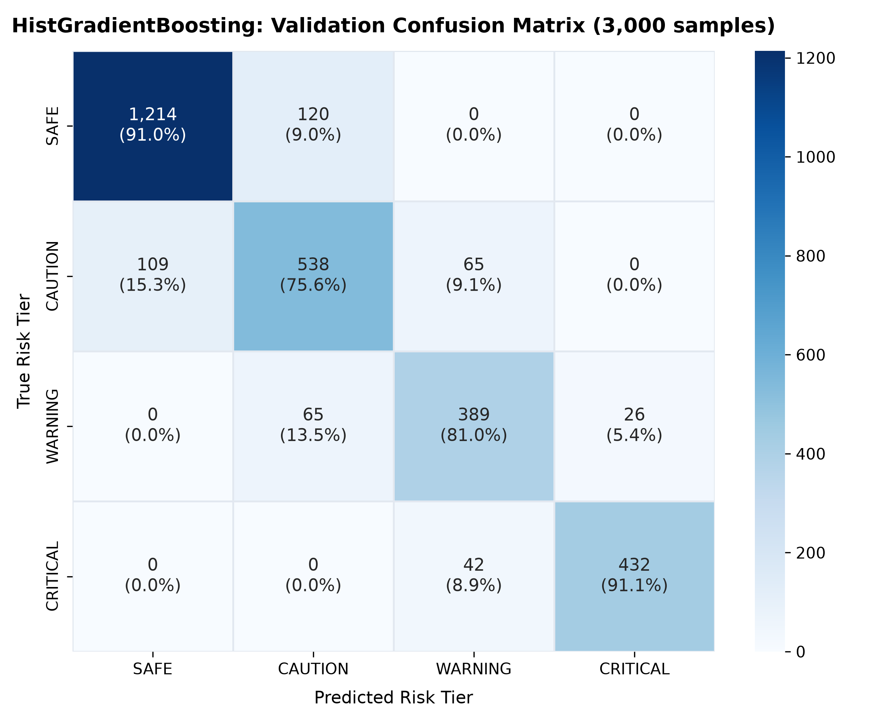
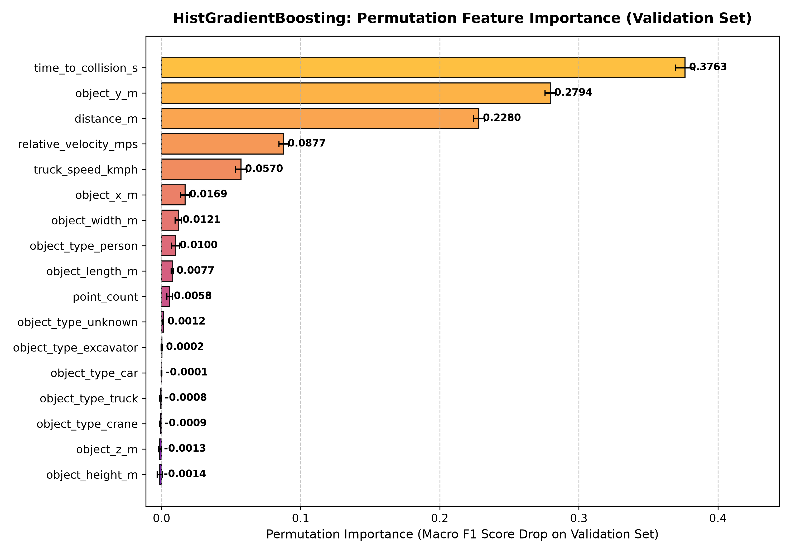

# mineRakshak-ai: Stage 6 HistGradientBoosting Training & Validation Report

> **CRITICAL DISCLAIMER & ENGINEERING PRINCIPLE:**
> These training results are obtained from the **SYNTHETIC PROTOTYPE DATASET**.
> They demonstrate second-model baseline performance on identical preprocessed partitions.
> They do **NOT** prove or represent real-world physical mine-site safety.

---

## 1. Model Configuration & Training Procedure

* **Scikit-Learn Version**: `1.9.1`
* **Python Version**: `3.14.7`
* **Model Class**: `sklearn.ensemble.HistGradientBoostingClassifier`
* **Random Seed**: `42`
* **Hyperparameters**:
  * `learning_rate`: `0.05`
  * `max_iter`: `500`
  * `max_leaf_nodes`: `31`
  * `max_depth`: `None`
  * `min_samples_leaf`: `20`
  * `l2_regularization`: `1.0`
  * `early_stopping`: `True`
  * `validation_fraction`: `None`
  * `random_state`: `42`

> **Validation Strategy Note:**
> In scikit-learn 1.9+, `HistGradientBoostingClassifier.fit` natively supports passing `X_val` and `y_val`.
> With `validation_fraction=None`, early stopping monitored the true external validation set (3,000 samples) without silently splitting `X_train`.
> Test data (`X_test`, `y_test`) remained **strictly untouched** for subsequent comparison.

## 2. Dataset Partition Discipline

| Partition | Samples | Role in Stage 6 |
| :--- | :---: | :--- |
| **Training (`X_train`)** | `14,000` (70%) | Histogram-based decision tree fitting |
| **Validation (`X_val`)** | `3,000` (15%) | Early stopping & performance evaluation |
| **Test (`X_test`)** | `3,000` (15%) | **Untouched**; strictly reserved for Stage 7 final evaluation |

## 3. Training Execution & Convergence

* **Training Duration**: `1.76 seconds`
* **Iterations Actually Used**: `159` (out of `500` maximum allowed)
* **Early Stopping**: Stopped early at iteration `159` due to validation loss plateau on `X_val`.

## 4. Validation Performance Summary (3,000 Samples)

* **Validation Accuracy**: **`85.77%`**
* **Validation Multiclass Log Loss**: **`0.3465`**
* **Macro-Averaged Precision**: **`84.73%`**
* **Macro-Averaged Recall**: **`84.69%`**
* **Macro-Averaged F1-Score**: **`0.8470`**
* **Weighted-Averaged F1-Score**: **`0.8583`**

### Detailed Per-Class Validation Breakdown:
| Class Tier | Precision | Recall | F1-Score | Validation Support |
| :--- | :---: | :---: | :---: | :---: |
| **`SAFE`** | `91.76%` | `91.00%` | `0.9138` | `1,334` |
| **`CAUTION`** | `74.41%` | `75.56%` | `0.7498` | `712` |
| **`WARNING`** | `78.43%` | `81.04%` | `0.7971` | `480` |
| **`CRITICAL`** | `94.32%` | `91.14%` | `0.9270` | `474` |

## 5. Safety-Critical Performance (WARNING & CRITICAL)

* **`WARNING` Performance**:
  * Precision: **`78.43%`**
  * Recall: **`81.04%`**
  * F1-Score: **`0.7971`**
* **`CRITICAL` Performance**:
  * Precision: **`94.32%`**
  * Recall: **`91.14%`**
  * F1-Score: **`0.9270`**

### False Negative Audit:
* **WARNING Events (480 total)**:
  * Missed to `SAFE`: `0` (zero catastrophic drops to SAFE)
  * Missed to `CAUTION`: `65`
  * Total False Negatives: `65` (13.54%)
* **CRITICAL Events (474 total)**:
  * Missed to `SAFE`: `0` (zero catastrophic drops to SAFE)
  * Missed to `CAUTION`: `0` (zero severe drops to CAUTION)
  * Missed to `WARNING`: `42` (conservative active alert preserved)
  * Total False Negatives: `42` (8.86%)

## 6. Confusion Matrix Interpretation

| True \ Predicted | SAFE | CAUTION | WARNING | CRITICAL | Total |
| :--- | :---: | :---: | :---: | :---: | :---: |
| **`SAFE`** | 1214 | 120 | 0 | 0 | 1334 |
| **`CAUTION`** | 109 | 538 | 65 | 0 | 712 |
| **`WARNING`** | 0 | 65 | 389 | 26 | 480 |
| **`CRITICAL`** | 0 | 0 | 42 | 432 | 474 |

*Interpretation: All CRITICAL errors fall strictly into the adjacent WARNING tier (42 samples), ensuring active collision alerting. Zero CRITICAL instances were misclassified as SAFE or CAUTION.*

## 7. Permutation Feature Importance (Validation Set)

| Rank | Feature Name | Mean Score Drop (Macro F1) | Std Deviation |
| :---: | :--- | :---: | :---: |
| 1 | `time_to_collision_s` | `0.3763` | `0.0067` |
| 2 | `object_y_m` | `0.2794` | `0.0038` |
| 3 | `distance_m` | `0.2280` | `0.0040` |
| 4 | `relative_velocity_mps` | `0.0877` | `0.0034` |
| 5 | `truck_speed_kmph` | `0.0570` | `0.0040` |
| 6 | `object_x_m` | `0.0169` | `0.0033` |
| 7 | `object_width_m` | `0.0121` | `0.0023` |
| 8 | `object_type_person` | `0.0100` | `0.0030` |
| 9 | `object_length_m` | `0.0077` | `0.0008` |
| 10 | `point_count` | `0.0058` | `0.0021` |

## 8. Saved Model & Evaluation Artifacts

| Artifact | File Path | Format | Description |
| :--- | :--- | :--- | :--- |
| **Model Weights** | `models/hgb_model.joblib` | Joblib | Trained HistGradientBoostingClassifier instance |
| **Model Metadata** | `models/hgb_metadata.json` | JSON | Scikit-learn version, Python version, hyperparameters |
| **Validation Metrics** | `results/metrics/hgb_validation_metrics.json` | JSON | Complete validation metrics and false-negative audit |
| **Validation Predictions** | `results/metrics/hgb_validation_predictions.csv` | CSV | Classes, probabilities, and confidence score |
| **Permutation Importance** | `results/metrics/hgb_feature_importance.csv` | CSV | Mean and std deviation of validation Macro F1 score drop |
| **Confusion Matrix Plot** | `results/plots/hgb_confusion_matrix.png` | PNG | Annotated heatmap of validation confusion matrix |
| **Importance Plot** | `results/plots/hgb_feature_importance.png` | PNG | Horizontal bar plot of permutation importance |

## 9. Comparison Readiness

Both XGBoost and HistGradientBoosting have now completed independent training and validation on identical splits.
The models are fully ready for fair, head-to-head comparison on the untouched test set in Stage 7.