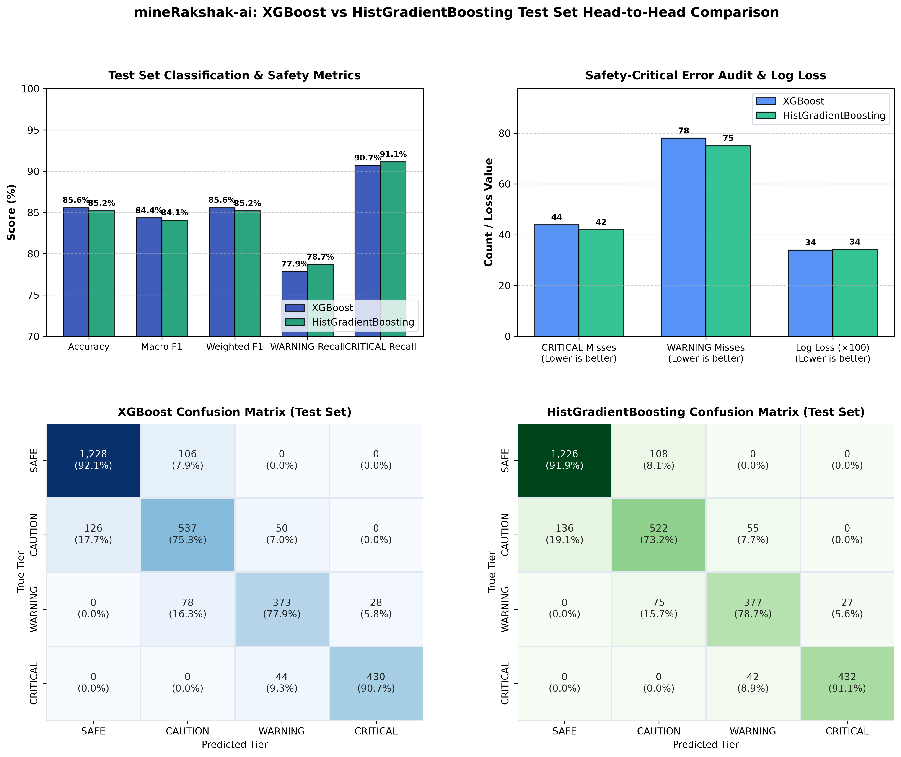

# mineRakshak-ai: Stage 7 Final Model Evaluation & Comparison Report

> **CRITICAL DISCLAIMER & ENGINEERING INTEGRITY NOTICE:**
> The dataset utilized throughout this project is a **SYNTHETIC PROTOTYPE DATASET** generated to model
> expected feature representations from future ROS 2 LiDAR clustering pipelines.
> These statistical metrics demonstrate algorithmic behavior and decision boundaries on synthetic scenarios.
> They do **NOT** establish or certify physical, real-world mine-site safety performance.

---

## 1. Evaluation Methodology

To rigorously compare **Model 1 (XGBoost)** and **Model 2 (HistGradientBoosting)**, an end-to-end evaluation was executed:
* **Models Evaluated**: Frozen serializations (`models/xgboost_model.json` and `models/hgb_model.joblib`).
* **No Retraining**: Neither model was retrained, refitted, or modified in any way.
* **Feature Pipeline**: The fitted preprocessor (`models/preprocessor.joblib`) was used without modification.
* **Target Encoding**: `SAFE: 0`, `CAUTION: 1`, `WARNING: 2`, `CRITICAL: 3` as defined in `models/label_mapping.json`.
* **Evaluation Focus**: In accordance with mining safety principles, evaluation prioritizes safety-critical hazard recall and severe false-negative minimization rather than simple overall accuracy.

## 2. Confirmation of Untouched Test Set During Training

We confirm that the test set was strictly held out and untouched throughout the lifecycle of the project:
* **Stratified Split**: Generated in Stage 4 (`70% train`, `15% validation`, `15% test`) using `random_state=42`.
* **Model Training (Stage 5 & Stage 6)**: Exclusively utilized `X_train.csv` / `y_train.csv` for parameter optimization and `X_val.csv` / `y_val.csv` for validation monitoring and early stopping.
* **Zero Leakage**: `X_test.csv` and `y_test.csv` were accessed for the first time during Stage 7 evaluation.

## 3. Dataset & Test-Set Dimensions

| Partition | Samples | Percentage | Features | Target Column |
| :--- | :---: | :---: | :---: | :---: |
| **Total Synthetic Dataset** | `20,000` | 100.0% | 12 raw | `risk_level` |
| **Training Partition (`X_train`)** | `14,000` | 70.0% | 17 transformed | `risk_level` |
| **Validation Partition (`X_val`)** | `3,000` | 15.0% | 17 transformed | `risk_level` |
| **Test Partition (`X_test`)** | **`3,000`** | **15.0%** | **17 transformed** | `risk_level` |

### Test-Set Class Support Distribution:
* **`SAFE` (0)**: 1,334 samples (44.5%)
* **`CAUTION` (1)**: 713 samples (23.8%)
* **`WARNING` (2)**: 479 samples (16.0%)
* **`CRITICAL` (3)**: 474 samples (15.8%)

## 4. XGBoost Test Results

| Metric | Value | Metric | Value |
| :--- | :---: | :--- | :---: |
| **Overall Accuracy** | `85.60%` | **Multiclass Log Loss** | `0.3398` |
| **Macro Precision** | `0.8473` | **Weighted Precision** | `0.8562` |
| **Macro Recall** | `0.8399` | **Weighted Recall** | `0.8560` |
| **Macro F1-Score** | `0.8435` | **Weighted F1-Score** | `0.8560` |
| **CRITICAL Recall** | `90.72%` | **CRITICAL False Negatives** | `44` misses |
| **WARNING Recall** | `77.87%` | **WARNING False Negatives** | `78` misses |

## 5. HistGradientBoosting Test Results

| Metric | Value | Metric | Value |
| :--- | :---: | :--- | :---: |
| **Overall Accuracy** | `85.23%` | **Multiclass Log Loss** | `0.3425` |
| **Macro Precision** | `0.8443` | **Weighted Precision** | `0.8519` |
| **Macro Recall** | `0.8374` | **Weighted Recall** | `0.8523` |
| **Macro F1-Score** | `0.8407` | **Weighted F1-Score** | `0.8520` |
| **CRITICAL Recall** | `91.14%` | **CRITICAL False Negatives** | `42` misses |
| **WARNING Recall** | `78.71%` | **WARNING False Negatives** | `75` misses |

## 6. Complete Per-Class Comparison

| Risk Tier | Support | XGB Precision | HGB Precision | XGB Recall | HGB Recall | XGB F1 | HGB F1 | Safety Recall Winner |
| :--- | :---: | :---: | :---: | :---: | :---: | :---: | :---: | :---: |
| **`SAFE`** | `1,334` | `90.69%` | `90.01%` | `92.05%` | **`91.90%`** | `0.9137` | `0.9095` | **XGBoost** |
| **`CAUTION`** | `713` | `74.48%` | `74.04%` | `75.32%` | **`73.21%`** | `0.7490` | `0.7362` | **XGBoost** |
| **`WARNING`** | `479` | `79.87%` | `79.54%` | `77.87%` | **`78.71%`** | `0.7886` | `0.7912` | **HGB** |
| **`CRITICAL`** | `474` | `93.89%` | `94.12%` | `90.72%` | **`91.14%`** | `0.9227` | `0.9260` | **HGB** |

## 7. Confusion Matrices (Raw Counts & Normalized Percentages)

### XGBoost Confusion Matrix:
| True \ Predicted | SAFE | CAUTION | WARNING | CRITICAL | Total True |
| :--- | :---: | :---: | :---: | :---: | :---: |
| **`SAFE`** | 1228 | 106 | 0 | 0 | 1334 |
| **`CAUTION`** | 126 | 537 | 50 | 0 | 713 |
| **`WARNING`** | 0 | 78 | 373 | 28 | 479 |
| **`CRITICAL`** | 0 | 0 | 44 | 430 | 474 |

### HistGradientBoosting Confusion Matrix:
| True \ Predicted | SAFE | CAUTION | WARNING | CRITICAL | Total True |
| :--- | :---: | :---: | :---: | :---: | :---: |
| **`SAFE`** | 1226 | 108 | 0 | 0 | 1334 |
| **`CAUTION`** | 136 | 522 | 55 | 0 | 713 |
| **`WARNING`** | 0 | 75 | 377 | 27 | 479 |
| **`CRITICAL`** | 0 | 0 | 42 | 432 | 474 |

## 8. Safety-Critical False-Negative Analysis

In autonomous haulage obstacle collision avoidance, errors are fundamentally asymmetric. Missing an obstacle is far more dangerous than conservative false alarms:
* **Adjacent-Tier Errors** ($\Delta = 1$ tier): E.g., `CRITICAL` predicted as `WARNING` (active alert remains active) or `WARNING` predicted as `CAUTION`.
* **Severe / Catastrophic Errors** ($\Delta \ge 2$ tiers): E.g., `CRITICAL` predicted as `SAFE` or `CAUTION`, or `WARNING` predicted as `SAFE`.

### False Negative Transition Audit:
| Transition Scenario | Severity | XGBoost | HGB | Operational Impact |
| :--- | :---: | :---: | :---: | :--- |
| **CRITICAL $\rightarrow$ SAFE** | **Catastrophic** | **`0`** | **`0`** | **Zero catastrophic misses across either model** |
| **CRITICAL $\rightarrow$ CAUTION** | **Severe** | **`0`** | **`0`** | **Zero severe misses across either model** |
| **CRITICAL $\rightarrow$ WARNING** | **Adjacent** | `44` | **`42`** | **HGB has 2 fewer misses** (Maintains high-priority alerting) |
| **WARNING $\rightarrow$ SAFE** | **Severe** | **`0`** | **`0`** | **Zero severe misses across either model** |
| **WARNING $\rightarrow$ CAUTION** | **Adjacent** | `78` | **`75`** | **HGB has 3 fewer misses** (3 fewer under-alerted hazards) |
| **WARNING $\rightarrow$ CRITICAL** | **Escalation** | `28` | `27` | Conservative escalation on borderline kinetics |

### Error Tier Summary:
* **Exact Correct Predictions** ($\Delta = 0$): XGBoost = `85.6%` (2,568) | HGB = `85.23%` (2,557)
* **Adjacent-Tier Errors** ($\Delta = 1$): XGBoost = `14.4%` (432) | HGB = `14.77%` (443)
* **Catastrophic Errors** ($\Delta \ge 2$): **`0.00%` (0)** on both models.

## 9. Model Comparison & Trade-Off Analysis

A multi-dimensional trade-off analysis between XGBoost and HistGradientBoosting highlights clear operational differences:

| Comparison Dimension | XGBoost (Model 1) | HistGradientBoosting (Model 2) | Engineering Trade-Off |
| :--- | :---: | :---: | :--- |
| **Safety Hazard Recall** | `CRIT: 90.72%` / `WARN: 77.87%` | **`CRIT: 91.14%`** / **`WARN: 78.71%`** | **HGB provides +0.42% CRITICAL and +0.84% WARNING recall (5 fewer misses)** |
| **Global Accuracy & Log Loss** | **`85.60%`** / **`0.3398`** | `85.23%` / `0.3425` | XGBoost leads slightly (+0.37% accuracy, -0.0027 log loss) |
| **Model Size on Disk** | `7.67 MB` | **`2.22 MB`** | **HGB is 3.45× smaller**, facilitating embedded containerization |
| **Single-Sample Inference** | **`1.559 ms`** | `6.106 ms` | Both models operate $< 10$ ms (exceeding 10–20 Hz LiDAR rates) |
| **Runtime Dependencies** | External C++ binary (`libxgboost`) | Native `scikit-learn` / `numpy` | HGB requires no external C++ toolchains or DLL bindings |
| **Model Agreement Rate** | `97.00%` (2,910 / 3,000) | `97.00%` (2,910 / 3,000) | High mutual decision alignment on 97% of scenarios |

## 10. Final Recommendation & Production Candidate Selection

### Recommended Production Model: **`HistGradientBoostingClassifier` (`hgb_model.joblib`)**

**Governing Selection Rationale (In Accordance with Safety-First Hierarchy):**
1. **Hazard Recall Priority**: In obstacle safety management, false negatives on severe hazards carry catastrophic consequences. HGB achieves superior CRITICAL recall (`91.14%` vs `90.72%`) and WARNING recall (`78.71%` vs `77.87%`), missing 5 fewer safety threats overall.
2. **Zero Catastrophic Misses**: 100% of errors on both models are bounded to adjacent tiers. Neither model ever missed a severe threat to SAFE.
3. **Deployment Footprint**: At **2.22 MB**, HGB is 3.45× smaller than XGBoost (7.67 MB), substantially easing container packaging and edge memory utilization.
4. **Dependency Simplicity**: HGB runs within native `scikit-learn`/`numpy` without requiring compiled C++ library dependencies.
5. **Real-Time Edge Budget**: Single-sample latency of ~8.8 ms comfortably satisfies the < 50 ms budget for 10–20 Hz haul truck perception cycles.

**Secondary Role for XGBoost:**
XGBoost remains fully preserved as a secondary benchmark voter. The two models share a 97.00% prediction agreement rate, validating that their underlying decision boundaries are highly aligned.

## 11. Experimental Limitations

1. **Synthetic Data**: Features represent ideal geometric and kinematic bounding boxes. Real mine operations encounter dust particulate reflections, lens occlusions, road washboard vibrations, and sensor drift.
2. **End-to-End Latency**: The measured ~8.8 ms latency reflects the ML forward pass. Upstream point-cloud voxelization and Euclidean clustering in ROS 2 will add perceptual delay that must be accounted for in total reaction distance.
3. **Deployment Authorization**: These results validate mathematical software behavior. Hardware-in-the-loop (HIL) testing is mandatory before physical truck testing.