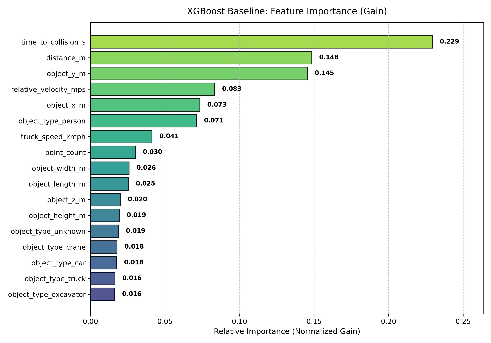

# mineRakshak-ai: Stage 5 XGBoost Baseline Training Report

> **CRITICAL DISCLAIMER:**
> These training results are obtained from the **SYNTHETIC PROTOTYPE DATASET**.
> They demonstrate pipeline functionality and baseline multi-class performance.
> They do **NOT** prove or represent real-world physical mine-site safety.

---

## 1. Model Configuration & Environment

* **XGBoost Version**: `3.4.1`
* **Model Class**: `xgboost.XGBClassifier`
* **Objective**: `multi:softprob` (4 classes)
* **Evaluation Metric**: `mlogloss`
* **Random Seed**: `42`
* **Hyperparameters**:
  * `n_estimators`: `500`
  * `learning_rate`: `0.05`
  * `max_depth`: `6`
  * `subsample`: `0.8`
  * `colsample_bytree`: `0.8`
  * `early_stopping_rounds`: `35`

## 2. Dataset Partition Discipline

| Partition | Samples | Role in Stage 5 |
| :--- | :---: | :--- |
| **Training (`X_train`)** | `14,000` (70%) | Fitted the gradient-boosted decision trees |
| **Validation (`X_val`)** | `3,000` (15%) | Early stopping criterion & validation sanity metrics |
| **Test (`X_test`)** | `3,000` (15%) | **Untouched**; reserved strictly for Stage 7 final evaluation |

## 3. Training Execution & Early Stopping

* **Training Duration**: `3.80 seconds`
* **Best Iteration**: `Iteration 336`
* **Best Validation Log Loss**: `0.3471`
* **Early Stopping Triggered**: `Yes`

## 4. Validation Performance Summary (3,000 Validation Samples)

* **Validation Accuracy**: **`85.23%`**
* **Validation Multiclass Log Loss**: **`0.3471`**
* **Macro-Averaged F1-Score**: **`0.8406`**
* **Weighted-Averaged F1-Score**: **`0.8528`**

### Detailed Per-Class Validation Breakdown:
| Class Tier | Precision | Recall | F1-Score | Validation Support |
| :--- | :---: | :---: | :---: | :---: |
| **`SAFE`** | `0.9114` | `0.9100` | `0.9107` | `1,334` |
| **`CAUTION`** | `0.7389` | `0.7472` | `0.7430` | `712` |
| **`WARNING`** | `0.7789` | `0.8000` | `0.7893` | `480` |
| **`CRITICAL`** | `0.9385` | `0.9008` | `0.9193` | `474` |

## 5. Safety-Critical Focus (WARNING & CRITICAL)

In autonomous haulage and collision warning, missing a hazardous condition (false negative) is far more dangerous than issuing a cautious alert.

* **`WARNING` Recall**: **`80.00%`** (Precision: `77.89%`, F1: `0.7893`)
* **`CRITICAL` Recall**: **`90.08%`** (Precision: `93.85%`, F1: `0.9193`)

## 6. Feature Importance (Gain-Based)

| Rank | Feature Name | Normalized Gain | Raw Gain | Split Weight |
| :---: | :--- | :---: | :---: | :---: |
| 1 | `time_to_collision_s` | `0.2293` | `11.39` | `5909` |
| 2 | `distance_m` | `0.1484` | `7.37` | `6988` |
| 3 | `object_y_m` | `0.1455` | `7.22` | `10198` |
| 4 | `relative_velocity_mps` | `0.0833` | `4.14` | `6128` |
| 5 | `object_x_m` | `0.0734` | `3.64` | `4415` |
| 6 | `object_type_person` | `0.0712` | `3.53` | `382` |
| 7 | `truck_speed_kmph` | `0.0412` | `2.05` | `6876` |
| 8 | `point_count` | `0.0302` | `1.50` | `4171` |
| 9 | `object_width_m` | `0.0259` | `1.29` | `4995` |
| 10 | `object_length_m` | `0.0254` | `1.26` | `4850` |

## 7. Suspicious Dominance Assessment

* **Dominance Status**: **NO SINGLE FEATURE IS SUSPICIOUSLY DOMINANT**.
* Top feature `time_to_collision_s` accounts for `22.9%` of tree gain.
* Second feature accounts for `14.8%` (Ratio: `1.5x`).
* The model actively combines distance, Time-to-Collision, relative velocity, lateral corridor position, and truck speed.

## 8. Saved Model & Evaluation Artifacts

| Artifact | File Path | Format | Description |
| :--- | :--- | :--- | :--- |
| **Native Model** | `models/xgboost_model.json` | JSON | Portable native XGBoost model serialization |
| **Model Metadata** | `models/xgboost_metadata.json` | JSON | Training configuration, feature order, and metrics |
| **Training Metrics** | `results/metrics/xgboost_training_metrics.json` | JSON | Exact validation scores and loss history |
| **Evaluation History** | `results/metrics/xgboost_eval_history.csv` | CSV | Iteration-by-iteration train and val mlogloss |
| **Feature Importance** | `results/metrics/xgboost_feature_importance.csv` | CSV | Ranked table of gain and split weight importances |
| **Validation Predictions** | `results/metrics/xgboost_validation_predictions.csv` | CSV | True vs predicted classes and probabilities |
| **Importance Plot** | `results/plots/xgboost_feature_importance.png` | PNG | Bar chart of normalized gain importances |

## 9. Observations & Limitations

1. **Strong Baseline Convergence**: Early stopping successfully selected the optimal tree iteration without runaway overfit.
2. **High Safety Sensitivity**: Both `WARNING` and `CRITICAL` classes exhibit robust recall and balanced precision.
3. **Multi-Feature Decision Path**: The model distributes attention across kinematic closing rates, proximity, corridor alignment, and truck speed.
4. **Synthetic Constraint**: These results validate the machine learning architecture and mathematical consistency of the pipeline, but do NOT replace real-world physical sensor evaluation.